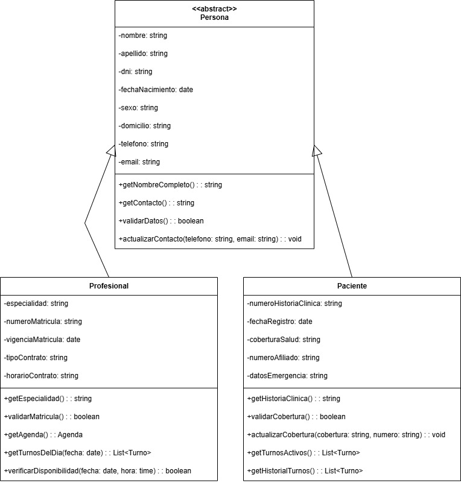

#  Abstracción

En el diseño orientado a objetos, la abstracción es el proceso mediante el cual se identifican y modelan únicamente los aspectos esenciales de un objeto o concepto del mundo real, ocultando los detalles innecesarios o irrelevantes para el contexto específico del sistema a diseñar, facilitando la comprensión y el diseño del código. En cuanto a los mecanismos de implementación puede darse por dos formas:

+ *Clases Abstractas:* Definen una estructura parcial que debe ser completada por las subclases. Proporcionan una base común mientras delegan la implementación específica a las clases derivadas.

+ *Interfaces:* Establecen contratos que definen qué métodos debe implementar una clase sin especificar cómo, solo comportamientos sin proporcionar implementación.

## Relación con principios SOLID:

*Si bien la aplicación del los principios SOLID en forma concurrente genera un diseño de sistema eficiente y un estado cumplimiento general de los principios de POO, la relación principal de la Abstracción se da con los siguientes:*

+ **Single Responsibility Principle (SRP)**: La abstracción ayuda a definir responsabilidades claras y únicas para cada clase. Al abstraer solo los aspectos esenciales de una entidad, naturalmente se delimita su responsabilidad principal, evitando la sobrecarga de funcionalidades no relacionadas.

+ **Dependency Inversion Principle (DIP)**: La abstracción es fundamental para la inversión de dependencias, ya que permite que los módulos de alto nivel dependan de abstracciones (interfaces) en lugar de implementaciones concretas.

## Relación con patrones de diseño: 

+ **Patrones Creacionales**: Por ejemplo, lo patrones Factory Method y Abstract Factory, utilizan abstracciones para simplificar la de creación de objetos. Factory lo implementa a traves de una superclase, delegando a las subclases la decisión de qué clase concreta instanciar; mientras que que Abstract extiende la abstracción para crear familias completas de objetos relacionados sin especificar clase concreta.

+ **Patrones Estructurales**: En primer lugar, el patrón Bridge, utiliza la abstracción para separar completamente "qué hace un objeto" de "cómo lo hace". Crea dos jerarquías independientes: una abstracción que define las operaciones de alto nivel que ve el cliente, y una implementación que define las operaciones que ejecutan. Esto permite que ambas jerarquías evolucionen independientemente.

Por otro lado, patrones como Adapter y Decorator, emplean abstracciones para definir interfaces comunes que permiten la interoperabilidad entre componentes incompatibles en el primero o la extensión transparente de funcionalidades en el segundo.

   * En Adapter, la abstracción es esencial para hacer compatible sistemas con interfaces incompatibles. El adaptador implementa la interfaz abstracta esperada por el cliente mientras internamente traduce las llamadas a la interfaz del sistema adaptado. Esta abstracción oculta la incompatibilidad y permite tratar sistemas heterogéneos de manera uniforme.

   * En cuanto a Decorator, la abstracción permite que tanto el objeto original como todos los "añadidos" (decoradores) se vean iguales desde afuera, permitiendo añadir capas de funcionalidades sin afectar las anteriores porque cada nueva capa puede tratar a lo que está debajo como si fuera el objeto original porque todos usan la misma abstracción para comunicarse.

+ **Patrones de Comportamiento**: Patrones como Strategy y State utilizan abstracciones para encapsular algoritmos y comportamientos variables, permitiendo su intercambio dinámico sin afectar el contexto.

    * En Strategy, por ejemplo, se define una abstracción común para una familia de algoritmos intercambiables. Esta  abstracción separa la interfaz del algoritmo de su implementación, permitiendo agregar nuevos algoritmos en forma modular simplificada.

    * Respecto a State, la abstracción define operaciones comunes que todos los estados deben implementar. Cada estado concreto maneja estas operaciones según su lógica específica, mientras que el contexto delega comportamientos a través de la abstracción. Esto permite que el objeto cambie de comportamiento dinámicamente manteniendo una interfaz consistente.
 
## Ejemplo en el proyecto

La clase abstracta Persona y sus especializaciones Paciente y Profesional aplican el principio de abstracción al incluir únicamente los atributos esenciales para el sistema de gestión de turnos médicos. Se eligen datos como nombre, DNI, contacto y fecha de nacimiento porque son necesarios para identificar personas, enviar notificaciones y validar identidades en el contexto médico. Los atributos específicos (historia clínica y cobertura para pacientes; matrícula y especialidad para profesionales) están directamente relacionados con sus roles en la atención médica. Se omiten deliberadamente datos irrelevantes como bienes registrables, ingresos económicos o gustos personales, porque no contribuyen a los objetivos del sistema contribuyendo, así, a una mejor comprensión y facilidad de diseño.

[**Link Drawio**](https://drive.google.com/file/d/1vqLEjgyxjCP_PLtnMom2xZRY9ASmMjuE/view?usp=sharing)

## Ejemplo de Código

