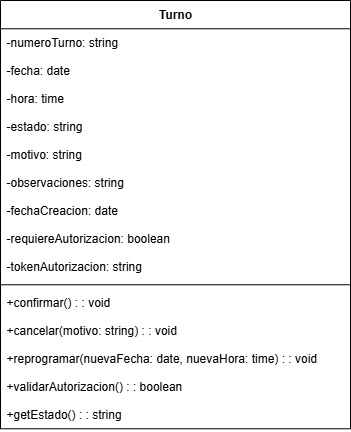

# Encapsulamiento 

El encapsulamiento es el principio de la POO que busca ocultar los detalles internos de implementación de un objeto, exponiendo únicamente una interfaz pública controlada que permita interactuar con el objeto de manera segura y coherente. Se materializa a través de modificadores de visibilidad que definen quién puede acceder a cada elemento de la clase: Los modificadores private ocultan completamente los atributos del acceso externo, protected permite acceso a subclases y clases del mismo paquete, mientras que public expone elementos que forman parte de la interfaz pública del objeto.

## Relación con principios SOLID

*Si bien la aplicación del los principios SOLID en forma concurrente genera un diseño de sistema eficiente y un estado cumplimiento general de los principios de POO, la relación principal del Encapsulamiento se da con los siguientes:*

+ **Interface Segregation Principle (ISP)**: El encapsulamiento implementa directamente el ISP mediante los modificadores de visibilidad que controlan exactamente qué métodos y datos son accesibles desde el exterior, permitiendo crear interfaces públicas específicas y enfocadas para diferentes tipos de clientes. Al marcar elementos como privados, protegidos o públicos, el encapsulamiento evita que las clases cliente dependan de funcionalidades internas que no necesitan, exponiendo solo los métodos relevantes para cada uso específico y segregando automáticamente las interfaces según las necesidades de cada cliente.

+ **Open/Closed Principle (OCP):** El encapsulamiento facilita el OCP al ocultar los detalles de implementación interna detrás de una interfaz pública estable, permitiendo que la implementación interna de una clase sea modificada sin afectar el código cliente que depende únicamente de los métodos públicos. Esta separación entre interfaz pública (cerrada para modificación) e implementación privada (abierta para modificación interna) hace posible que las clases evolucionen internamente sin romper el contrato público establecido por la clase base.

## Relación con patrones de diseño

+ **Patrones Creacionales**: Por ejemplo, Builder encapsula el proceso complejo de construcción de objetos paso a paso, ocultando los detalles de cómo se ensamblan las partes internas y exponiendo solo métodos específicos para configurar cada aspecto, mientras que Prototype encapsula la lógica de clonación de objetos manteniendo privados los detalles de copia profunda y exponiendo solo el método clone() para crear duplicados.

+ **Patrones Estructurales**: Composite encapsula la complejidad de manejar tanto objetos individuales como grupos de objetos detrás de una interfaz común, ocultando si se está trabajando con una hoja o un contenedor, mientras que Facade encapsula múltiples subsistemas complejos detrás de una interfaz unificada y simplificada, manteniendo privadas las interacciones entre subsistemas.

+ **Patrones de Comportamiento**: Command encapsula una solicitud completa como un objeto, ocultando los detalles del receptor, la acción y los parámetros detrás de un método execute() simple, mientras que Observer encapsula la lista de observadores y los mecanismos de notificación dentro del sujeto, exponiendo solo métodos públicos para agregar/remover observadores sin revelar cómo se gestiona internamente la comunicación.

## Ejemplo en el proyecto

La clase Turno del diagrama de clases representa un ejemplo de encapsulamiento al mantener todos sus atributos como privados (-numeroTurno, -fecha, -hora, -estado, -motivo, -observaciones, -fechaCreacion, -requiereAutorizacion, -tokenAutorizacion) protegiendo así la integridad de los datos internos del turno médico. Los métodos públicos (+confirmar(), +cancelar(), +reprogramar(), +validarAutorizacion(), +getEstado()) proporcionan una interfaz controlada para interactuar con el turno, encapsulando las reglas de negocio y validaciones dentro de la clase. Esto evita que otras clases modifiquen directamente el estado del turno o accedan a información sensible como el token de autorización o el motivo, garantizando que todas las operaciones se realicen de manera segura.

[**Link Drawio**](https://drive.google.com/file/d/1v92S3EgiqqhLaLA7gSONAme8Hgf_yT43/view?usp=sharing)

## Ejemplo de PseudoCódigo

CLASE Turno
    PRIVADO numeroTurno: cadena
    PRIVADO fecha: fecha
    PRIVADO hora: tiempo
    PRIVADO estado: cadena
    PRIVADO motivo: cadena
    PRIVADO observaciones: cadena
    PRIVADO fechaCreacion: fecha
    PRIVADO requiereAutorizacion: booleano
    PRIVADO tokenAutorizacion: cadena

    CONSTRUCTOR Turno(numeroTurno, fecha, hora, motivo)
        ESTE.numeroTurno = numeroTurno
        ESTE.fecha = fecha
        ESTE.hora = hora
        ESTE.motivo = motivo
        ESTE.estado = "SOLICITADO"
        ESTE.fechaCreacion = fechaActual()
        ESTE.requiereAutorizacion = FALSO
        ESTE.tokenAutorizacion = ""
        ESTE.observaciones = ""
    FIN CONSTRUCTOR

    PÚBLICO confirmar(): vacío
        SI estado = "SOLICITADO" ENTONCES
            estado = "CONFIRMADO"
            IMPRIMIR "Turno confirmado"
        SINO
            LANZAR_EXCEPCIÓN "No se puede confirmar turno en estado " + estado
        FIN SI
    FIN MÉTODO

    PÚBLICO cancelar(motivoCancelacion: cadena): vacío
        SI estado ≠ "CANCELADO" Y estado ≠ "FINALIZADO" ENTONCES
            estado = "CANCELADO"
            observaciones = "Cancelado: " + motivoCancelacion
            IMPRIMIR "Turno cancelado"
        SINO
            LANZAR_EXCEPCIÓN "No se puede cancelar turno en estado " + estado
        FIN SI
    FIN MÉTODO

    PÚBLICO reprogramar(nuevaFecha: fecha, nuevaHora: tiempo): vacío
        SI estado = "SOLICITADO" O estado = "CONFIRMADO" ENTONCES
            fecha = nuevaFecha
            hora = nuevaHora
            estado = "SOLICITADO"
            observaciones = observaciones + " - Reprogramado"
            IMPRIMIR "Turno reprogramado"
        SINO
            LANZAR_EXCEPCIÓN "No se puede reprogramar turno en estado " + estado
        FIN SI
    FIN MÉTODO

    PÚBLICO validarAutorizacion(): booleano
        SI requiereAutorizacion ENTONCES
            RETORNAR tokenAutorizacion ≠ "" Y tokenAutorizacion ≠ NULO
        SINO
            RETORNAR VERDADERO
        FIN SI
    FIN MÉTODO

    PÚBLICO getEstado(): cadena
        RETORNAR estado
    FIN MÉTODO

FIN CLASE
