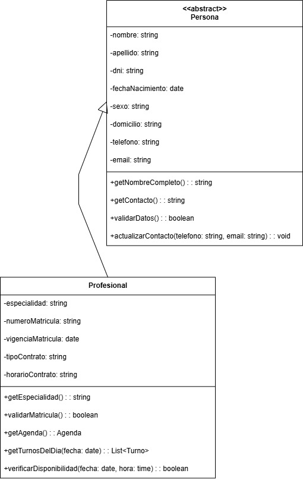

# Herencia

La herencia es el principio de la POO que permite que una subclase o clase derivada adquiera automáticamente los atributos y métodos de otra clase superclase o clase base superior, estableciendo una relación jerárquica que refleja conceptos de especialización y generalización del mundo real. Este principio facilita la reutilización de código al permitir que las clases compartan características comunes mientras desarrollan funcionalidades específicas.

## Relación con los Principios SOLID

*Si bien la aplicación del los principios SOLID en forma concurrente genera un diseño de sistema eficiente y un estado de cumplimiento general de los principios de POO, la relación principal de la Herencia se da con los siguientes:*

+ **Liskov Substitution Principle (LSP):** La herencia es el mecanismo principal que hace posible la sustitución de Liskov, ya que las subclases deben poder reemplazar a sus superclases sin alterar el comportamiento esperado del sistema, siendo fundamental que las clases derivadas respeten los contratos establecidos por sus clases base.

+ **Open/Closed Principle (OCP):** Facilita la extensión del sistema mediante la creación de nuevas subclases que agregan funcionalidad sin modificar las clases base existentes, permitiendo que el código sea abierto para extensión pero cerrado para modificación al heredar comportamientos base y especializarlos.

+ **Dependency Inversion Principle (DIP)**: Permite que el código cliente dependa de clases base abstractas o interfaces mientras trabaja con implementaciones específicas de las subclases, facilitando la inversión de dependencias al hacer que módulos de alto nivel dependan de abstracciones que las subclases implementan.

## Relacion con los patrones de diseño

+ **Patrones Creacionales:** Factory Method utiliza herencia como mecanismo central donde diferentes subclases creator heredan de una clase base y especializan el método de creación, permitiendo que cada subclase defina qué tipo específico de producto crear mientras mantiene la estructura general heredada.

+ **Patrones Estructurales:** Composite emplea herencia donde tanto elementos simples (hojas) como elementos complejos (contenedores) heredan de la misma clase base Component, permitiendo construir estructuras de árbol donde todos los nodos pueden ser tratados uniformemente.
  
+ **Patrones de Comportamiento:** Template Method depende completamente de herencia donde la clase base define el esqueleto del algoritmo con métodos abstractos que las subclases deben implementar, permitiendo reutilizar la estructura algorítmica mientras se especializa el comportamiento específico mediante herencia.
  
## Ejemplo en el proyecto

La jerarquía Persona → Profesional representa un ejemplo de herencia donde la clase abstracta Persona define los atributos y métodos comunes a todas las personas del sistema (nombre, apellido, dni, fechaNacimiento, sexo, domicilio, telefono, email) junto con operaciones básicas como getNombreCompleto(), getContacto(), validarDatos() y actualizarContacto(). La subclase Profesional (y paciente también) hereda automáticamente todas estas características comunes y añaden sus propios atributos específicos: especialidad, numeroMatricula, tipoContrato con métodos como validarMatricula() y verificarDisponibilidad(). Esta herencia permite reutilizar todo el código común de gestión de personas mientras cada subclase especializa funcionalidades específicas de su rol en el sistema médico, evitando duplicación de código y facilitando el mantenimiento.

[**Link Drawio**](https://drive.google.com/file/d/1vqLEjgyxjCP_PLtnMom2xZRY9ASmMjuE/view?usp=sharing)

## Ejemplo de PseudoCódigo

    CLASE Profesional HEREDA DE Persona
         PRIVADO especialidad: cadena
         PRIVADO numeroMatricula: cadena
         PRIVADO vigenciaMatricula: fecha
         PRIVADO tipoContrato: cadena
         PRIVADO horarioContrato: cadena

        CONSTRUCTOR Profesional(nombre, apellido, dni, fechaNacimiento, sexo, domicilio, telefono, email, especialidad, numeroMatricula, vigenciaMatricula)
            SUPER(nombre, apellido, dni, fechaNacimiento, sexo, domicilio, telefono, email)
            ESTE.especialidad = especialidad
            ESTE.numeroMatricula = numeroMatricula
            ESTE.vigenciaMatricula = vigenciaMatricula
            ESTE.tipoContrato = ""
            ESTE.horarioContrato = ""
        FIN CONSTRUCTOR

        PÚBLICO getEspecialidad(): cadena
            RETORNAR especialidad
        FIN MÉTODO

        PÚBLICO validarMatricula(): booleano
            fechaActual = fechaActual()
            RETORNAR vigenciaMatricula >= fechaActual Y numeroMatricula <> ""
        FIN MÉTODO

        PÚBLICO getAgenda(): Agenda
            // Lógica para obtener agenda del profesional
            RETORNAR nuevaAgenda
        FIN MÉTODO

        PÚBLICO getTurnosDelDia(fecha: fecha): Lista<Turno>
            // Lógica para obtener turnos de una fecha específica
            RETORNAR listaTurnos
        FIN MÉTODO

        PÚBLICO verificarDisponibilidad(fecha: fecha, hora: tiempo): booleano
            // Lógica para verificar disponibilidad en fecha y hora
            RETORNAR disponible
        FIN MÉTODO

    FIN CLASE

