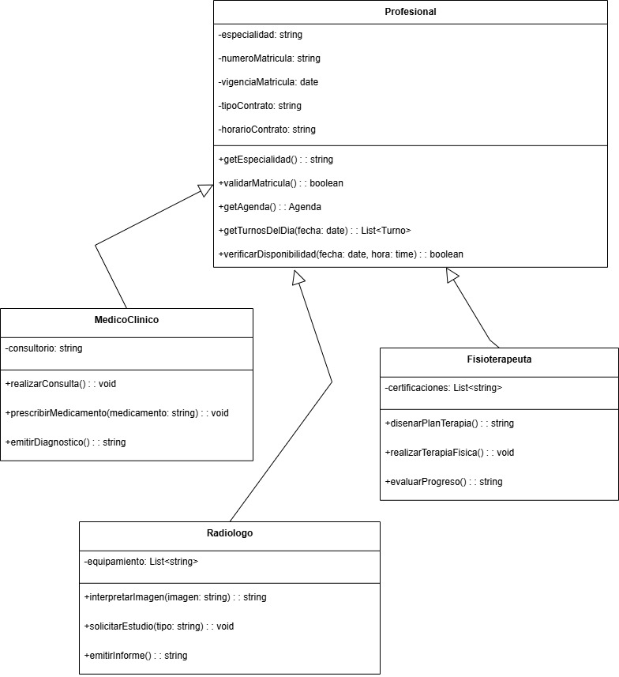

# Poliformismo

El polimorfismo es el principio que permite que objetos de diferentes clases respondan de manera distinta a la misma interfaz o mensaje, manteniendo la capacidad de ser tratados de manera uniforme. Este principio establece que una misma operación puede comportarse de forma diferente según el tipo específico del objeto que la ejecute, permitiendo que el código cliente trabaje con abstracciones sin conocer los detalles específicos de cada implementación concreta, obteniendo reutilización de código genérico flexibilidad y extensibilidad. 

## Relación con principios SOLID

*Si bien la aplicación del los principios SOLID en forma concurrente genera un diseño de sistema eficiente y un estado cumplimiento general de los principios de POO, la relación principal del Poliformismo se da con los siguientes:*

+ **Open/Closed Principle (OCP):** Facilita la extensión del sistema mediante nuevas implementaciones polimórficas sin modificar el código cliente existente, ya que las nuevas clases pueden implementar las mismas interfaces y ser utilizadas de manera intercambiable.

+ **Liskov Substitution Principle (LSP):** El polimorfismo solo funciona correctamente cuando las subclases pueden sustituir completamente a sus clases base sin alterar el comportamiento esperado del sistema, siendo este principio fundamental para que el polimorfismo sea seguro y predecible.

## Relación con patrones de diseño

+ **Patrones Creacionales:** Por ejemplo, Factory Method utiliza polimorfismo donde diferentes factories concretos implementan el método de creación de manera específica, permitiendo que el código cliente solicite productos sin conocer qué clase concreta se instanciará, ya que cada factory sabe cómo crear su tipo específico de producto. Por otro lado, Abstract Factory emplea polimorfismo para que diferentes familias de factories implementen la misma interfaz de creación, permitiendo intercambiar familias completas de productos relacionados donde cada factory crea productos compatibles entre sí.

+ **Patrones Estructurales:** En relación a estructurales, Adapter utiliza polimorfismo implementando la interfaz esperada por el cliente mientras internamente traduce las llamadas al objeto adaptado, permitiendo que objetos con interfaces incompatibles sean tratados como si implementaran la interfaz requerida. En cuanto a Bridge, emplea polimorfismo separando la abstracción de su implementación, donde diferentes implementaciones concretas proporcionan comportamientos específicos para la misma abstracción, permitiendo que el código cliente use la abstracción sin conocer qué implementación específica está ejecutando el trabajo real.

+ **Patrones de Comportamiento:** Respecto a los de tipo de comportamiento, Mediator utiliza polimorfismo donde diferentes mediadores concretos implementan estrategias específicas de comunicación entre componentes, permitiendo cambiar la lógica de mediación sin afectar los componentes que se comunican. Por su parte, Memento emplea polimorfismo en los objetos memento donde diferentes tipos de originadores crean mementos específicos que encapsulan su estado interno de manera particular, permitiendo restaurar estados de diferentes tipos de objetos de manera uniforme.

## Ejemplo en el proyecto

En el sistema de turnos médicos, el polimorfismo se manifiesta en la jerarquía de profesionales médicos: las clases MedicoClinico, Radiologo y Fisioterapeuta que heredan de Profesional representan un ejemplo perfecto de polimorfismo donde cada especialidad puede responder de manera específica a operaciones médicas comunes. De esta forma, no solo se permite flexibilidad en el diseño, sino que se facilita la extensibilidad y mantenibilidad del código al proporcionar mecanismos para tratar objetos diversos de manera uniforme mientras respetan sus comportamientos específicos.

[**Link Drawio**](https://drive.google.com/file/d/1y0vTbJRasJFrk-96eqUQ9xebRLURWaHm/view?usp=sharing)

## Ejemplo de Código
