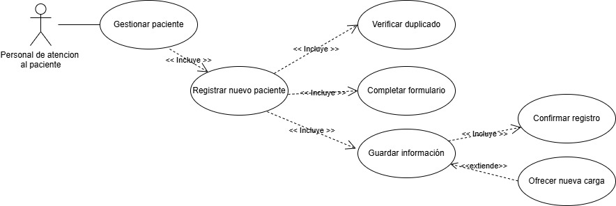
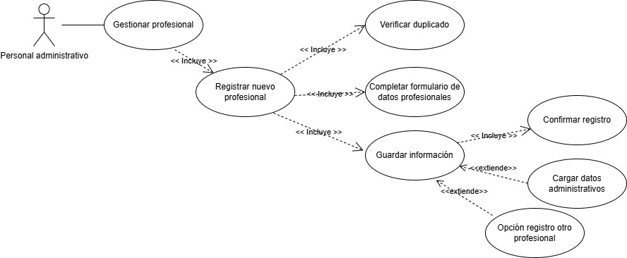
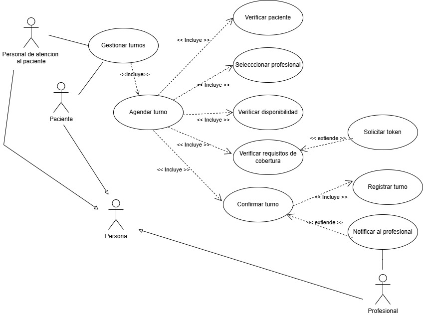
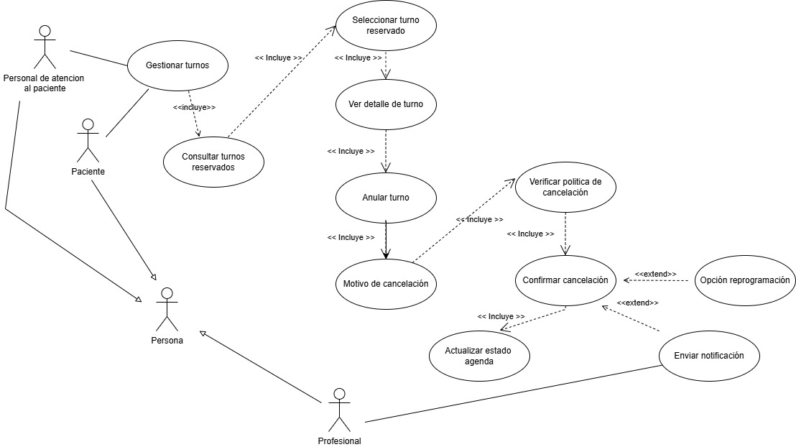

# Diagramas de caso de uso

  * [**Caso de Uso 1 - Registrar un paciente nuevo al sistema**](https://drive.google.com/file/d/1gqbKxbKr99smZwZoad9d3zYGZxz_ZBoZ/view?usp=sharing)

     

  * [**Caso de Uso 2 - Registrar un nuevo profesional de la salud**](https://drive.google.com/file/d/1IEqID8MmNIqJDLiXWrhqr4Q18oNPFC_F/view?usp=sharing)

     

  * [**Caso de Uso 3 - Asignar un turno con un médico para un paciente**](https://drive.google.com/file/d/13YnIRvslD2gM2JxfGcTzWoj-Gd7qL1sQ/view?usp=sharing)

     

  * [**Caso de Uso 4 - Anular un turno programado**]
(https://drive.google.com/file/d/19bbOUkOlMTHml6LT2BeNsSBiXBAUdii1/view?usp=sharing)

     

  * [**Caso de Uso 5 - Envío de recordatorios de turnos**(https://drive.google.com/file/d/1iOY2gqar2242Mdg2wQM0gBTlMssjwujO/view?usp=sharing)

     

  * [**Caso de Uso 6 - Crear Agenda para un profesional**]
(https://drive.google.com/file/d/13YnIRvslD2gM2JxfGcTzWoj-Gd7qL1sQ/view?usp=sharing)

     

    
