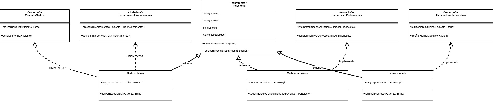

# Principio de Inversión de Dependencias (DIP) 

El principio DIP establece que los módulos de alto nivel no deben depender de módulos de bajo nivel, sino que ambos deben depender de abstracciones. Mediante este principio, se ocultan los detalles de implementación, ganando flexibilidad ante cambios.

## Motivación 

En el sistema de gestión de turnos, por ejemplo, si el componente de gestión de turnos dependiera directamente de una implementación específica de notificación (como Whatsapp, SMS, o email), cualquier cambio en el sistema de notificaciones requeriría modificar el gestor de turnos. Este acoplamiento directo dificulta:

* Realizar pruebas unitarias aisladas: Cambiar entre diferentes implementaciones (por ejemplo, pasar de notificaciones por email a notificaciones por app).
* Mantener y evolucionar el sistema de forma independiente.

## Estructura de Clases 

 
 * [Link drawio](https://drive.google.com/file/d/1bpLAHIN75-rAq2f_ZS1Fsg5ckWt631E_/view?usp=sharing)
