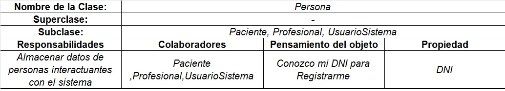
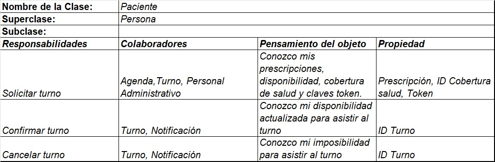
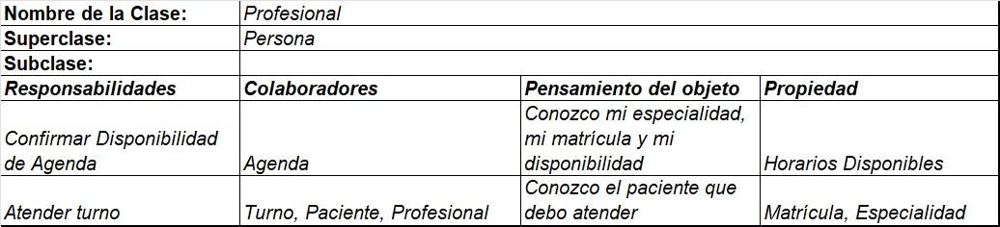
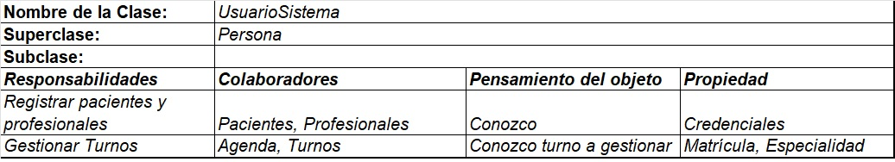
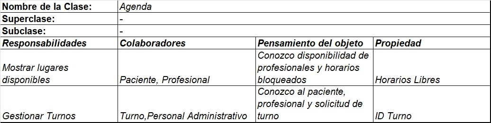
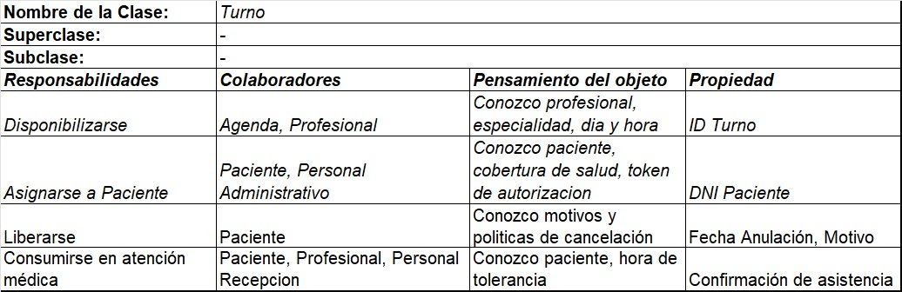
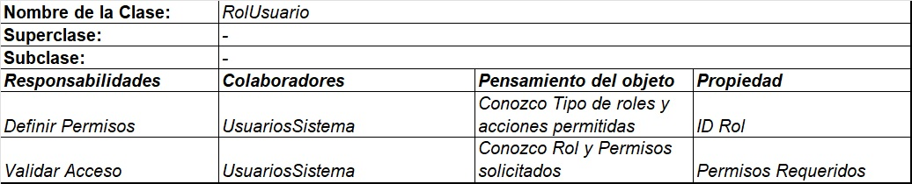
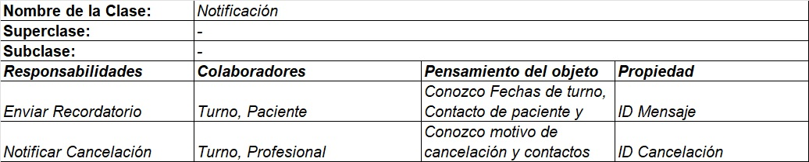

# Herramientas Agile

## Tarjetas CRC

[Link Plantilla Excel](https://docs.google.com/spreadsheets/d/1KuODJVl_M1LPLMHcnLgc6_j3mVGJ47Kq/edit?usp=sharing&ouid=109477294990424102788&rtpof=true&sd=true)

