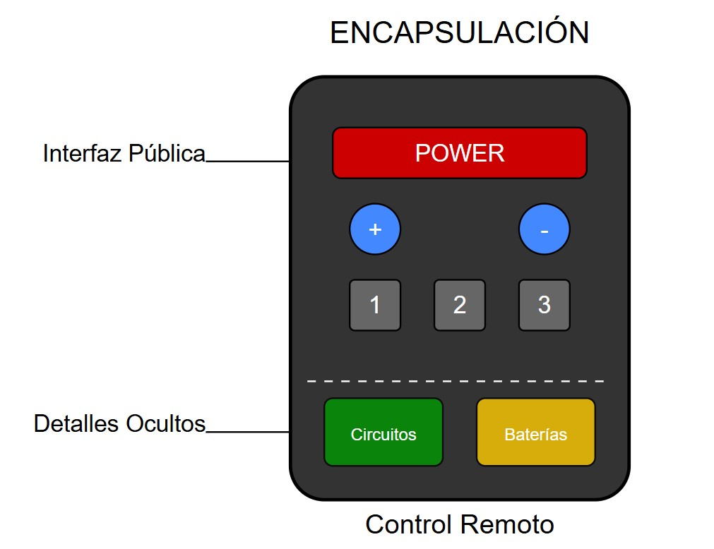
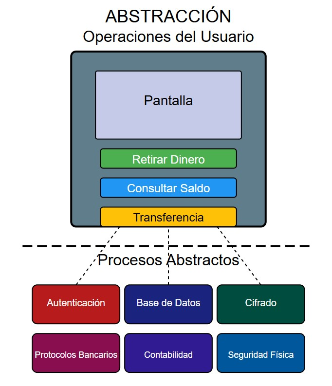
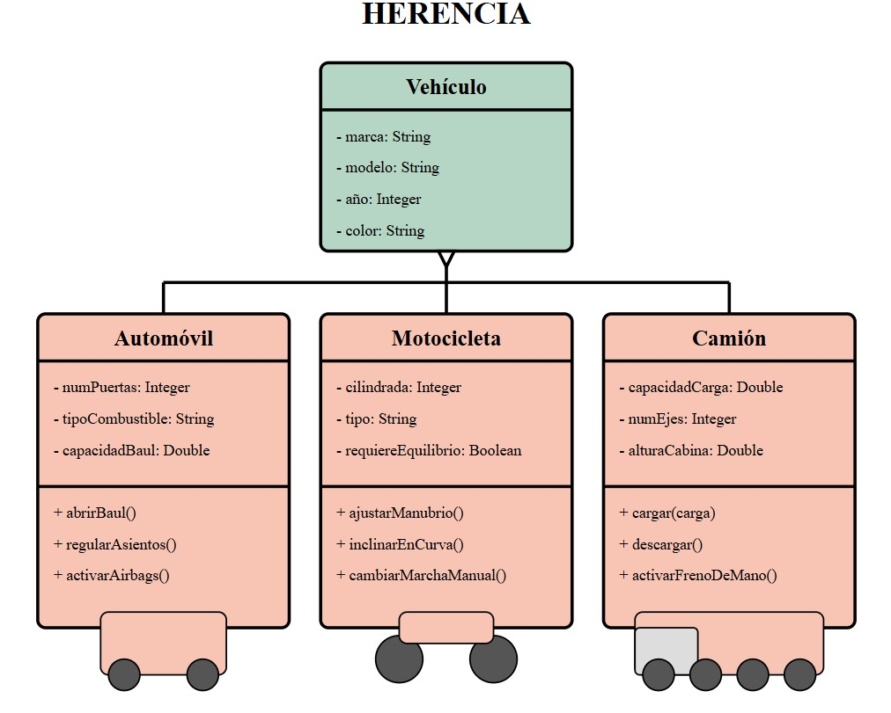
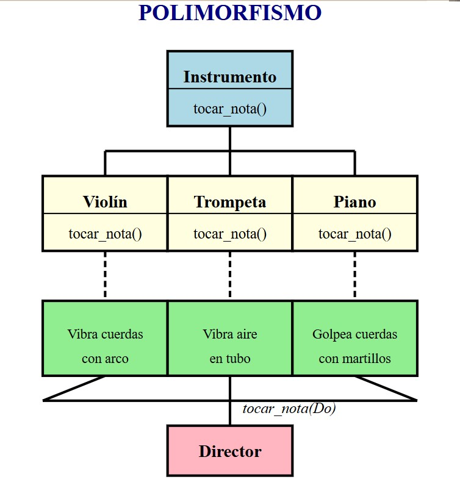
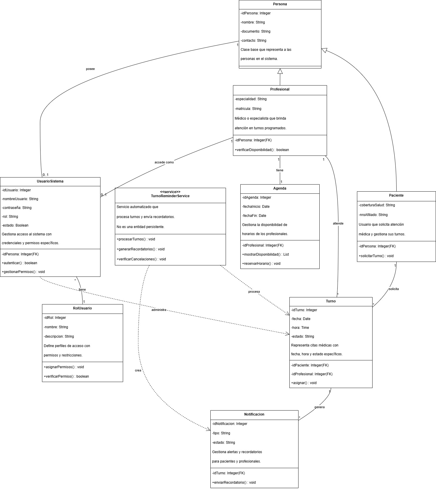

# Anexo 1 - Introducción al Diseño Orientado a Objetos

## Concepto del Paradigma Orientado a Objetos

La programación orientada a objetos (en adelante POO) es un enfoque conceptual específico para diseñar programas. Este paradigma se concentra en entidades del mundo real como las percibe el usuario, partiendo de la abstracción como objetos, que tienen datos y comportamientos aosciados. 

Lo distintivo de la POO es la técnica de poner todos los atributos y métodos de un objeto en una estructura independiente, la propia clase. En otras palabras, esos objetos son son las "cosas" relevantes para el sistema bajo análisis, mientras que las clases son agrupaciones de objetos que son óptimas para reutilizarse y darles mantenimiento. Una clase define el conjunto de atributos y comportamientos compartidos por cada objeto de la clase. Los programadores deben definir las diversas clases en el programa que escriben, y cuando el programa se ejecuta, los objetos se pueden crear a partir de la clase establecida.

### Diferencias entre la POO y el paradigma de programación estructural

El paradigma estructurado se basa en la división del programa en procedimientos y funciones independientes, con tareas específicas, mientras que la POO se organiza en torno a objetos que son instancias de clases que encapsulan datos y comportamientos relacionados. De esta forma, al crear objetos que contienen datos y código de programación, un cambio en un objeto tiene un impacto mínimo en otros objetos, lo que mejora el mantenimiento, asi como permite la reusabilidad de objetos, reduciendo los costos de desarrollo en sistemas computacionales y facilitando su escalabilidad.

## Los cuatro fundamentos de POO

+ **I. Encapsulación:** Ocultamiento de de detalles internos del objeto, exponiendo solo sus interfaces públicas, favoreciendo, así, la modularidad y la seguridad del sistema.
  
  - *EJ: El control remoto es un objeto que encapsula toda su complejidad interna (circuitos, baterías, sensores infrarrojos) detrás de una interfaz simple (los botones).*

    

+ **II. Abstracción:**  Simplificar la complejidad de los objetos reales modelando solo los aspectos esenciales relevantes para el sistema.

  - *EJ: El la utilización de un cajero automático por parte de un usuario. La máquina presenta solo funciones simples al usuario (retirar dinero, consultar saldo, transferir) mientras oculta toda la complejidad subyacente. El usuario no necesita entender los sistemas de autenticación, las consultas a bases de datos, los protocolos de comunicación interbancaria o los mecanismos de seguridad que operan tras cada botón que presiona.*

    

+ **III. Herencia:** Permite que un objeto obtenga propiedades y comportamientos de otro objeto, a través de una jerarquía de clases, permitiendo la reutilización del código.

  - *EJ: Los vehículos de transporte automotor representan un ejemplo herencia. Todos los vehículos comparten características comunes (motocicletas, automóviles, camiones, etc), pero cada tipo específico tiene sus propias peculiaridades.*

    

+ **IV. Polimorfismo:**:  Capacidad de los objetos de una misma jerarquía de clases para responder de manera diferente a un mismo mensaje, permitiendo flexibilidad a través de código genérico.

   - *EJ: Los instrumentos musicales de una orquesta, donde cada instrumento (violín, trompeta, piano) hereda de la clase base InstrumentoMusical e implementa el método tocar_nota() según su naturaleza física única. Cuando el director solicita "tocar Do", está invocando el mismo método en objetos de diferentes clases, pero cada uno produce el sonido de manera distinta: el violín mediante cuerdas vibradas con un arco, la trompeta a través de vibraciones de aire en un tubo metálico, y el piano golpeando cuerdas con martillos*

    

## Requisitos iniciales del sistema

+ **I. Protección de datos personales:** Solo el personal autorizado podrá acceder a los datos sensibles de contacto tanto de pacientes como de médicos, garantizando la privacidad.

+ **II. Alta de pacientes y profesionales:**  El sistema brindará la posibilidad de incorporar nuevos registros de pacientes y médicos al sistema de forma sencilla y organizada.

+ **III. Distribución de turnos según disponibilidad:** La asignación de turnos se realizará teniendo en cuenta los horarios disponibles de cada profesional de la salud.

+ **IV. Visualización de agenda médica:** Cada médico podrá acceder a un calendario donde visualizará todos los turnos que tiene programados.

+ **V. Avisos automáticos:** El sistema enviará comunicaciones por correo electrónico y/o mensajes de Whatsapp a pacientes para informar sobre confirmaciones, cancelaciones o cambios en los turnos.

## Casos de uso

+ **I. Registrar un paciente nuevo al sistema**

  - *Actor(es):* Personal de atención al paciente
  - *Descripción:* El personal carga la información de un paciente que aún no figura en la base.
  - *Flujo principal:*
      a. Se accede al módulo de gestión de pacientes.
      b. Se completan los campos con apellido y nombre, tipo y número de documento o identificación, fecha de nacimiento,             tipo e identificación de cobertura de salud y datos de contacto.
      c. Se guarda la información y se muestra un mensaje confirmando la operación.
  - *Precondición:* El paciente no debe estar previamente registrado.
  - *Postcondición:* El paciente se agrega correctamente a la base de datos.

+ **II. Registrar un nuevo profesional de la salud**

  - *Actor(es):* Personal administrativo, de recursos humanos o del sector con potestad para la tarea
  - *Descripción:* El personal autorizado ingresa los datos de un médico que comenzará a atender en el centro.
  - *Flujo principal:*
      a. Se accede al módulo de registro de profesionales.
      b. Se completan los campos obligatorios: nombre completo, especialidad, tipo y número de matrícula profesional y datos          de contacto.
      c. Se guarda el registro y se confirma la incorporación.
  - *Precondiciones:* El médico no debe estar previamente cargado en el sistema.
  - *Postcondiciones:* El profesional queda disponible para la asignación de turnos y visible en la agenda médica.

+ **III. Asignar un turno con un médico para un paciente**

  - *Actor(es):* Paciente, personal de atención al paciente
  - *Descripción:* Se agenda una consulta para un paciente, respetando la disponibilidad del profesional.
  - *Flujo principal:*
      a. Se elige al paciente y al médico.
      b. Se selecciona una fecha y hora dentro del horario libre del médico.
      c. Se confirma el turno y se informa al paciente.
  - *Precondición:* El profesional debe tener disponibilidad en el horario elegido y el paciente debe cumplimentar posibles                      prescripciones médicas aplicables así como también validacion de cobertura (incluyendo verificación de                       token de autorización).
  - *Postcondición:* El turno queda registrado y se envía un aviso correspondiente.

+ **IV. Anular un turno programado**
 
  - *Actor(es):* Paciente, personal de atención al paciente
  - *Descripción:* El turno puede ser cancelado por el paciente o por el personal del centro de salud ante un imprevisto.
  - *Flujo principal:*
      a. El paciente o el personal elige el turno que desea cancelar desde la plataforma
      b. Confirma la anulación.
      c. El sistema informa al médico que ese horario ha quedado libre.
  - *Precondición:* El turno debe estar vigente.
  - *Postcondición:* El turno se anula y se libera el espacio correspondiente en la agenda.

+ **V. Envío de recordatorios de turnos**

  - *Actor(es):* Gestor de turnos (módulo de automatización de funciones), servidor de mail o mensajería instantánea.
  - *Descripción:* El sistema se encarga de recordar al paciente que tiene una cita próxima.
  - *Flujo principal:*
      a. El sistema revisa la agenda.
      b. Si hay una consulta próxima, envía un mensaje por correo electrónico o mensaje de Whatsapp.
      c. El paciente recibe la notificación
      d. El paciente confirma asistencia o solicita cancelación.
  - *Precondición:* Debe haber un turno programado.
  - *Postcondición:* El paciente recibe el aviso a tiempo.

## Boceto inicial del diseño de clases

**Link Drawio:** https://drive.google.com/file/d/1vFd70BRh0BuMLam6-RxGJqXAKmhSRiL2/view?usp=sharing

 
