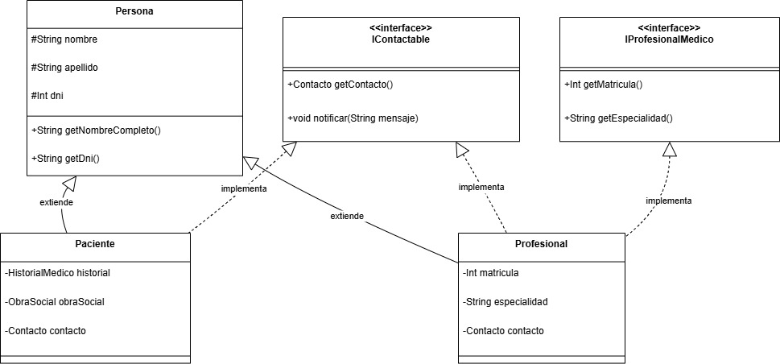

# Principio de Sustitución de Liskov (LSP) 

El principio LSP establece que una subclase debe poder sustituir a su superclase sin alterar el comportamiento esperado del sistema. Es decir, los objetos derivados deben poder ser utilizados donde se espera un objeto de la clase base, sin provocar efectos inesperados o romper la lógica del programa. Esto promueve la coherencia jerárquica, el uso seguro de la herencia y mejora la extensibilidad del código.

En el concepto de contratos, el LSP también establece que las precondiciones no pueden ser más restrictivas y las postcondiciones no pueden ser menos restrictivas en un los subtipos. Asimismo, las invariantes de las superclases deben mantenerse en las subclases. 

Es posible aplicar este principio a la jerarquía entre las clases Persona, Paciente y Profesional, garantizando que ambos puedan usarse indistintamente como Persona sin afectar la lógica general del sistema. El mal uso de la herencia puede romper este principio si alguna subclase no cumple con los contratos esperados por su clase base.

## Motivación 
 
En el diseño original, Persona define atributos comunes como nombre, apellido, DNI y contacto, y se espera que sus subclases respeten ese contrato básico. Sin embargo, si Paciente o Profesional sobrescriben comportamientos o agregan restricciones que contradicen o ignoran las expectativas definidas en Persona, se rompe el principio de sustitución. Para respetar el LSP, cuando reemplazamos un objeto Persona por un objeto Paciente o Profesional, el sistema debe seguir funcionando correctamente.

Por ejemplo:

* I. Si cualquier parte del sistema llama a getContacto() en una Persona, espera recibir información de contacto válida. Una       clase Paciente que devuelva null o lance una excepción rompería esta expectativa.
  
* II. Si el sistema muestra el nombre completo de una Persona para identificación, espera un formato estándar (nombre     apellido).
  
* III. Si la clase Profesional cambia este formato añadiendo su matrícula, podría confundir a partes del sistema que esperan solo el nombre civil.

## Estructura de Clases 
 
 
 * [Link drawio](https://drive.google.com/file/d/1G9xnnU522INfkFLSaW0FNrvK4YuNtFjL/view?usp=sharing)
