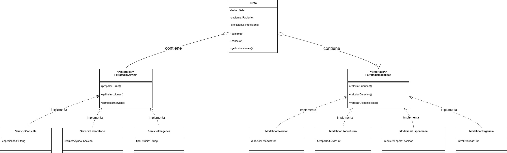

# Principio de Abierto/Cerrado (OCP)

El principio OCP establece que los módulos de software deben ser abiertos para su extensión de modo tal que puedan ser ampliados con nuevos comportamientos pero cerrados para su modificación para no realizar cambios en el código fuente al agregar las nuevas funcionalidades. La forma de implementar este principio es a través del poliformismo, por interfaces o clases abstractas.

Aplicado a la clase turnos, este principio permite añadir nuevos tipos de turnos y requisitos de los mismos para distintos tipos de servicios pero sin modificar el código existente de la clase original.

## Motivación

En un centro médico, existen diferentes tipos de turnos que requieren información y procesos específicos:

+ Por servicio:
  - Un turno de laboratorio requiere indicaciones sobre ayuno previo
  - Un turno de estudios de diagnóstico necesita preparaciones especiales y equipamiento
  - Una consulta general tiene requisitos básicos de documentación

+ Por tipo de turno:
  - Un turno normal tiene ciertas características de duración, espera estándar y clausulas de cancelación
  - Un sobreturno puede poseer diferentes restricciones
  - Un turno urgente o de demanda espontánea por ciertas características de los síntomas del paciente puede requerir otro         tipo de prioridades.

Sin aplicar OCP, tendríamos una clase turno monolítica que contendría condicionales para manejar cada especialidad, haciendo que cada nueva especialidad requiriera modificar la clase existente.

## Estructura de Clases

 
 * [Link drawio](https://drive.google.com/file/d/1R1WujRBbFwS2cII3Ohx8CVwmzr9upmUp/view?usp=sharing)
