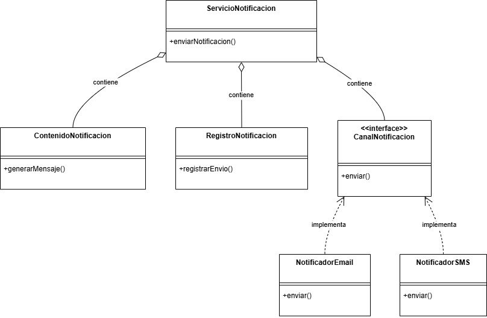

# Principio de Responsabilidad Única (SRP)

El SRP, basado en el principio de cohesión de Tom Demarco, establece que una clase debe tener una única razón para cambiar, es decir, una sola responsabilidad bien definida. Esto implica limitar el impacto de los cambios en el sistema, haciendolos mas fácil de implementar, dado que al darse clases claramente definidas se minimizan los efectos colaterales en otras ("acople").

Es posible aplicar este principio a la clase Notificación, la cual, en el diseño previo, posee varias responsabilidades relacionadas a la función de mensajería, generando alto acoplamiento y bajo mantenimiento al tornarse propensa a errores ante cualquier ajuste.

## Motivación

En el diseño original, la clase Notificación podría tener múltiples responsabilidades:

  * Crear el contenido del mensaje
  * Determinar el canal de comunicación (email, Whatsapp, etc)
  * Enviar la notificación
  * Registrar el estado de envío
  * Programar recordatorios

Esto viola el SRP porque la clase tiene múltiples razones para cambiar:

  * Si cambiamos el formato de los mensajes, debemos modificar la clase
  * Si añadimos un nuevo canal de comunicación, debemos modificar la clase
  * Si cambiamos la forma de registrar los envíos, debemos modificar la misma clase

En un escenario real, esto equivaldría a tener un único empleado que redacta mensajes, maneja el sistema de emails, gestiona Whatsapp, y también actualiza el registro de comunicaciones, siendo demasiadas responsabilidades para una función.

## Estructura de Clases 

[Link drawio](https://drive.google.com/file/d/1Hv9hF0RbSZp7Z3l3Hp_q-i7rDVaMNCo3/view?usp=sharing)

